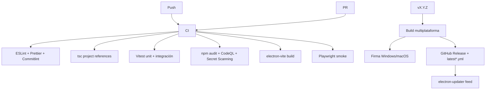

# Pipeline CI/CD

## 0. Estado de implementación

| Elemento | Estado |
|---|---|
| `ci.yml` (push/PR → lint, typecheck, test, smoke, build + verificación de artefactos) | ✅ |
| `release.yml` (tag `v*` → build x3 OS + `--publish always` a GitHub Releases) | ✅ (sin firma aún) |
| `security.yml` (npm audit + CodeQL) | ✅ |
| Playwright E2E (smoke de la app empaquetada) | ⏳ FASE 7 pendiente |
| Firma Authenticode / notarización macOS | ⏳ requiere certificados |

## 1. Flujo de trabajo GitHub Actions

## 2. Workflows

| Workflow | Eventos | Job |
|---|---|---|
| `ci.yml` | push + PR | lint, typecheck, test, audit, build, e2e |
| `codeql.yml` | push + schedule | CodeQL (js) |
| `release.yml` | tag `v*` | build x3, firma, publish, changelog |
| `security.yml` | schedule | `npm audit`, `osv-scanner` |

## 3. Versión y commits

- **Semantic Versioning** (`semver`): `major.minor.patch` (+ `-beta.N`, `-rc.N`).
- **Conventional Commits**: `feat`, `fix`, `perf`, `refactor`, `docs`, `ci`, `build`, `chore`, `test`, `revert` — validado con **commitlint** + **husky**.
- Changelog generado automáticamente a partir de los commits (`git-cliff` o manual en `scripts/release.mjs`).
- La versión se centraliza en `package.json` de `apps/desktop`; los paquetes workspace usan `workspace:*`.

## 4. Firma y secrets

| Secret | Uso |
|---|---|
| `WIN_CSC_LINK` / `WIN_CSC_KEY_PASSWORD` | Certificado Authenticode (Windows) |
| `APPLE_ID`, `APPLE_APP_SPECIFIC_PASSWORD`, `APPLE_TEAM_ID` | Notarización macOS |
| `GH_TOKEN` | Publicar release |

- Sin certificado → se publica release `alpha`/canal `dev` sin auto-instalación (la app bloquea updates sin firma en producción).
- Dependabot (semanal) + Renovate para compat (solo repo configurado). CodeQL y secret scanning habilitados por defecto.

## 5. Calidad

- Coverage mínimo **90%** en domain y core (los adaptadores de UI se excluyen de la métrica dura, se mide igualmente).
- `npm run lint`, `npm run typecheck`, `npm run test` obligatorios en el pre-push (husky).
