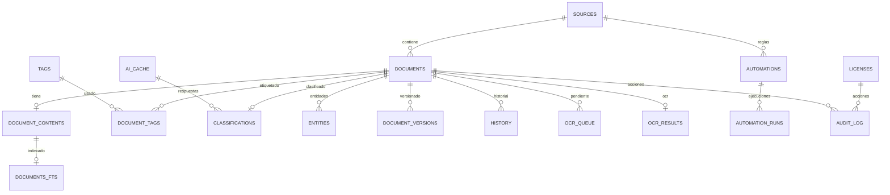

# Modelo de datos

Base local: **SQLite** (`better-sqlite3`), `PRAGMA journal_mode=WAL`, `synchronous=NORMAL`, `foreign_keys=ON`, `busy_timeout=5000`. Las migraciones son versionadas (`schema_migrations`) y viven en `packages/core/db/migrations/`.

## Diagrama entidad-relación



## DDL (SQLite)

```sql
-- Migración 001: núcleo
CREATE TABLE IF NOT EXISTS sources (
  id            INTEGER PRIMARY KEY,
  path          TEXT NOT NULL UNIQUE,
  name          TEXT NOT NULL,
  kind          TEXT NOT NULL DEFAULT 'folder',          -- folder | file
  scan_mode     TEXT NOT NULL DEFAULT 'recursive',       -- recursive | flat
  enabled       INTEGER NOT NULL DEFAULT 1,
  last_scan_at  TEXT,
  created_at    TEXT NOT NULL DEFAULT (datetime('now'))
);

CREATE TABLE IF NOT EXISTS documents (
  id                INTEGER PRIMARY KEY,
  source_id         INTEGER REFERENCES sources(id) ON DELETE CASCADE,
  path              TEXT NOT NULL,
  filename          TEXT NOT NULL,
  ext               TEXT NOT NULL,
  mime_type         TEXT,
  size_bytes        INTEGER NOT NULL DEFAULT 0,
  hash_sha256       TEXT NOT NULL,                       -- deduplicación
  status            TEXT NOT NULL DEFAULT 'pending',     -- pending|extracting|ocr|ai|indexed|error
  title             TEXT,
  content_preview   TEXT,
  ocr_confidence    REAL,
  language          TEXT,
  version           INTEGER NOT NULL DEFAULT 1,
  is_duplicate_of   INTEGER REFERENCES documents(id) ON DELETE SET NULL,
  file_mtime_ms     INTEGER,                             -- para watcher
  added_at          TEXT NOT NULL DEFAULT (datetime('now')),
  updated_at        TEXT NOT NULL DEFAULT (datetime('now')),
  deleted_at        TEXT,
  UNIQUE (source_id, path)
);
CREATE INDEX idx_documents_status ON documents(status);
CREATE INDEX idx_documents_hash   ON documents(hash_sha256);
CREATE INDEX idx_documents_ext    ON documents(ext);
CREATE INDEX idx_documents_mtime  ON documents(file_mtime_ms);

CREATE TABLE IF NOT EXISTS document_contents (
  document_id   INTEGER PRIMARY KEY REFERENCES documents(id) ON DELETE CASCADE,
  content       TEXT NOT NULL,
  content_hash  TEXT NOT NULL,
  fts_indexed_at TEXT
);

-- FTS5: external content (sin duplicar el texto en la tabla FTS)
CREATE VIRTUAL TABLE documents_fts USING fts5(
  title, content,
  content='document_contents', content_rowid='document_id',
  tokenize='porter unicode61'
);
CREATE TRIGGER documents_fts_ai AFTER INSERT ON document_contents BEGIN
  INSERT INTO documents_fts(rowid, title, content)
  SELECT document_id, (SELECT title FROM documents WHERE id = new.document_id), content
  FROM document_contents WHERE document_id = new.document_id;
END;
CREATE TRIGGER documents_fts_ad AFTER DELETE ON document_contents BEGIN
  INSERT INTO documents_fts(documents_fts, rowid, title, content) VALUES('delete', old.document_id, old.content, old.content);
END;
CREATE TRIGGER documents_fts_au AFTER UPDATE ON document_contents BEGIN
  INSERT INTO documents_fts(documents_fts, rowid, title, content) VALUES('delete', old.document_id, old.content, old.content);
  INSERT INTO documents_fts(rowid, title, content)
  SELECT document_id, (SELECT title FROM documents WHERE id = new.document_id), content
  FROM document_contents WHERE document_id = new.document_id;
END;
```

```sql
-- Migración 002: etiquetas, clasificación, entidades
CREATE TABLE IF NOT EXISTS tags (
  id          INTEGER PRIMARY KEY,
  name        TEXT NOT NULL UNIQUE,
  color       TEXT,
  created_at  TEXT NOT NULL DEFAULT (datetime('now'))
);
CREATE TABLE IF NOT EXISTS document_tags (
  document_id INTEGER NOT NULL REFERENCES documents(id) ON DELETE CASCADE,
  tag_id      INTEGER NOT NULL REFERENCES tags(id) ON DELETE CASCADE,
  PRIMARY KEY (document_id, tag_id)
);
CREATE INDEX idx_document_tags_tag ON document_tags(tag_id);

CREATE TABLE IF NOT EXISTS classifications (
  document_id INTEGER PRIMARY KEY REFERENCES documents(id) ON DELETE CASCADE,
  category    TEXT NOT NULL,
  confidence  REAL NOT NULL,
  provider    TEXT NOT NULL,
  model       TEXT NOT NULL,
  cached      INTEGER NOT NULL DEFAULT 0,
  created_at  TEXT NOT NULL DEFAULT (datetime('now'))
);

CREATE TABLE IF NOT EXISTS entities (
  id          INTEGER PRIMARY KEY,
  document_id INTEGER NOT NULL REFERENCES documents(id) ON DELETE CASCADE,
  kind        TEXT NOT NULL,          -- person|org|email|invoice|amount|date|iban
  value       TEXT NOT NULL,
  confidence  REAL,
  created_at  TEXT NOT NULL DEFAULT (datetime('now'))
);
CREATE INDEX idx_entities_doc ON entities(document_id, kind);
CREATE INDEX idx_entities_value ON entities(value);
```

```sql
-- Migración 003: OCR, cola, caché IA y consumo
CREATE TABLE IF NOT EXISTS ocr_results (
  document_id    INTEGER PRIMARY KEY REFERENCES documents(id) ON DELETE CASCADE,
  language       TEXT NOT NULL,
  confidence     REAL NOT NULL,
  text           TEXT NOT NULL,
  engine_version TEXT,
  created_at     TEXT NOT NULL DEFAULT (datetime('now'))
);
CREATE TABLE IF NOT EXISTS ocr_queue (
  id             INTEGER PRIMARY KEY,
  document_id    INTEGER NOT NULL UNIQUE REFERENCES documents(id) ON DELETE CASCADE,
  priority       INTEGER NOT NULL DEFAULT 0,
  status         TEXT NOT NULL DEFAULT 'pending',   -- pending|processing|done|error
  attempts       INTEGER NOT NULL DEFAULT 0,
  next_retry_at  TEXT,
  created_at     TEXT NOT NULL DEFAULT (datetime('now')),
  updated_at     TEXT NOT NULL DEFAULT (datetime('now'))
);
CREATE INDEX idx_ocr_queue_status ON ocr_queue(status, priority);

CREATE TABLE IF NOT EXISTS ai_cache (
  id           INTEGER PRIMARY KEY,
  request_hash TEXT NOT NULL UNIQUE,   -- sha256(prompt + params + provider + model)
  provider     TEXT NOT NULL,
  model        TEXT NOT NULL,
  response     TEXT NOT NULL,
  created_at   TEXT NOT NULL DEFAULT (datetime('now')),
  expires_at   TEXT
);
CREATE TABLE IF NOT EXISTS ai_usage (
  id              INTEGER PRIMARY KEY,
  provider        TEXT NOT NULL,
  model           TEXT NOT NULL,
  task            TEXT NOT NULL,        -- classify|summarize|extract|qa|search
  prompt_tokens   INTEGER NOT NULL DEFAULT 0,
  completion_tokens INTEGER NOT NULL DEFAULT 0,
  est_cost_usd    REAL NOT NULL DEFAULT 0,
  latency_ms      INTEGER NOT NULL DEFAULT 0,
  cached          INTEGER NOT NULL DEFAULT 0,
  created_at      TEXT NOT NULL DEFAULT (datetime('now'))
);
CREATE INDEX idx_ai_usage_created ON ai_usage(created_at);
```

```sql
-- Migración 004: historial, versionado, auditoría, backups, automatizaciones, licencias, settings, secrets
CREATE TABLE IF NOT EXISTS document_versions (
  id          INTEGER PRIMARY KEY,
  document_id INTEGER NOT NULL REFERENCES documents(id) ON DELETE CASCADE,
  version     INTEGER NOT NULL,
  path        TEXT NOT NULL,
  hash_sha256 TEXT NOT NULL,
  size_bytes  INTEGER NOT NULL,
  note        TEXT,
  created_at  TEXT NOT NULL DEFAULT (datetime('now'))
);
CREATE INDEX idx_doc_versions_doc ON document_versions(document_id, version);

CREATE TABLE IF NOT EXISTS history (
  id          INTEGER PRIMARY KEY,
  document_id INTEGER REFERENCES documents(id) ON DELETE CASCADE,
  action      TEXT NOT NULL,            -- created|updated|moved|renamed|tagged|classified|restored|deleted
  detail      TEXT,
  actor       TEXT DEFAULT 'system',
  created_at  TEXT NOT NULL DEFAULT (datetime('now'))
);
CREATE INDEX idx_history_doc ON history(document_id);
CREATE INDEX idx_history_created ON history(created_at);

CREATE TABLE IF NOT EXISTS audit_log (
  id          INTEGER PRIMARY KEY,
  actor       TEXT NOT NULL,
  action      TEXT NOT NULL,
  entity_type TEXT,
  entity_id   TEXT,
  detail      TEXT,
  created_at  TEXT NOT NULL DEFAULT (datetime('now'))
);
CREATE INDEX idx_audit_created ON audit_log(created_at);

CREATE TABLE IF NOT EXISTS backups (
  id          INTEGER PRIMARY KEY,
  path        TEXT NOT NULL,
  size_bytes  INTEGER NOT NULL,
  sha256      TEXT NOT NULL,
  kind        TEXT NOT NULL DEFAULT 'manual',  -- manual|scheduled
  status      TEXT NOT NULL DEFAULT 'done',
  created_at  TEXT NOT NULL DEFAULT (datetime('now'))
);

CREATE TABLE IF NOT EXISTS automations (
  id          INTEGER PRIMARY KEY,
  name        TEXT NOT NULL,
  enabled     INTEGER NOT NULL DEFAULT 1,
  trigger_type TEXT NOT NULL,           -- event:document:indexed|schedule:...
  action_type TEXT NOT NULL,            -- move|rename|tag|classify|delete
  config      TEXT NOT NULL,            -- JSON validado con Zod
  created_at  TEXT NOT NULL DEFAULT (datetime('now')),
  updated_at  TEXT NOT NULL DEFAULT (datetime('now'))
);
CREATE TABLE IF NOT EXISTS automation_runs (
  id          INTEGER PRIMARY KEY,
  automation_id INTEGER NOT NULL REFERENCES automations(id) ON DELETE CASCADE,
  document_id INTEGER REFERENCES documents(id) ON DELETE SET NULL,
  status      TEXT NOT NULL,
  detail      TEXT,
  ran_at      TEXT NOT NULL DEFAULT (datetime('now'))
);

CREATE TABLE IF NOT EXISTS licenses (
  id          INTEGER PRIMARY KEY,
  tier        TEXT NOT NULL DEFAULT 'free',   -- free|pro|enterprise
  status      TEXT NOT NULL DEFAULT 'active',
  key_cipher  BLOB,                            -- cifrada AES-256-GCM
  device_id   TEXT,
  activated_at TEXT,
  expires_at  TEXT,
  updated_at  TEXT NOT NULL DEFAULT (datetime('now'))
);

CREATE TABLE IF NOT EXISTS settings (
  key        TEXT PRIMARY KEY,
  value      TEXT NOT NULL,
  updated_at TEXT NOT NULL DEFAULT (datetime('now'))
);

CREATE TABLE IF NOT EXISTS secrets (
  id         INTEGER PRIMARY KEY,
  kind       TEXT NOT NULL UNIQUE,       -- openrouter_key|openai_key|...
  ciphertext BLOB NOT NULL,              -- AES-256-GCM
  iv         BLOB NOT NULL,
  auth_tag   BLOB NOT NULL,
  updated_at TEXT NOT NULL DEFAULT (datetime('now'))
);
```

## Migración a Postgres/Supabase (referencia futura)

Los repositorios (`packages/core/db/repositories/*`) implementan puertos de `packages/domain`. Una futura migración a Supabase solo reemplaza los adaptadores:

- FTS5 → `tsvector`/`pg_trgm` (Postgres full-text).
- `datetime('now')` → `now()` (ya se generan timestamps en la capa de aplicación, no en SQL).
- Se añadiría `bigserial` y `pgcrypto` para hash/dedupe.

La lógica de negocio no cambia (ADR-0003, ADR-0004).
