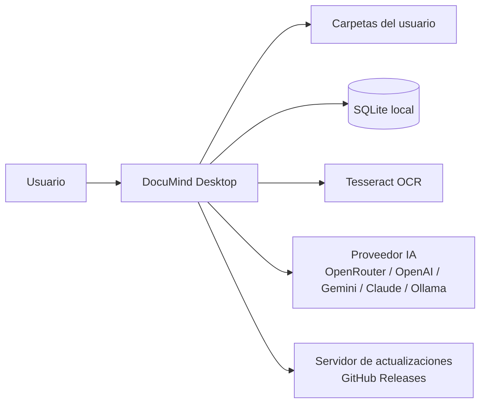
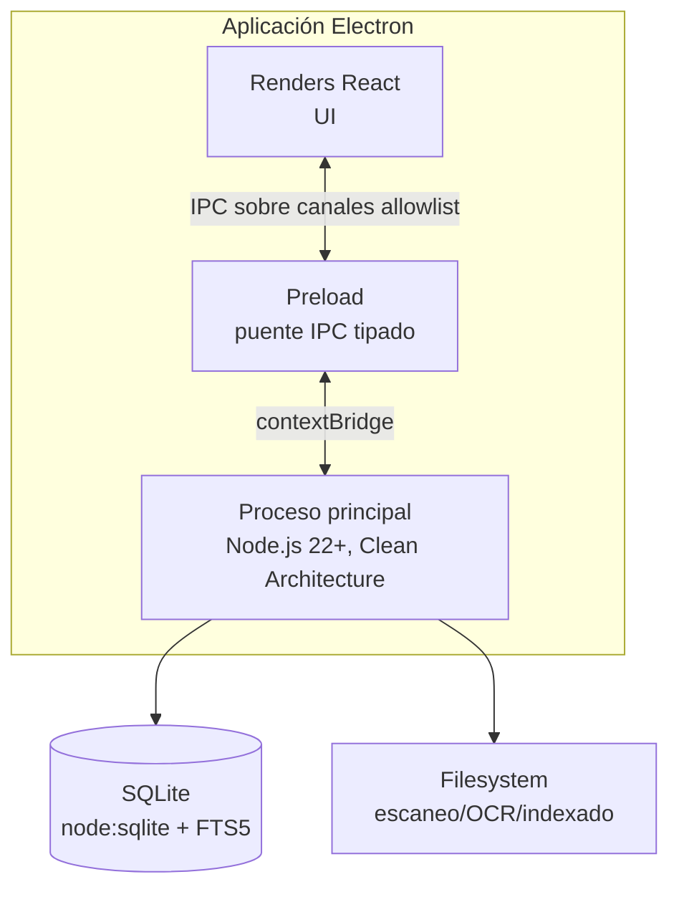
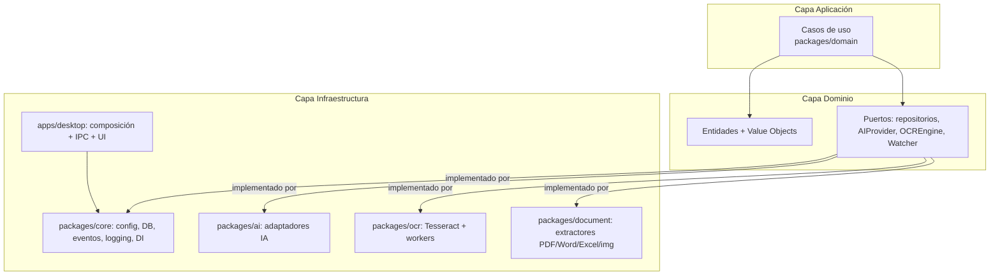
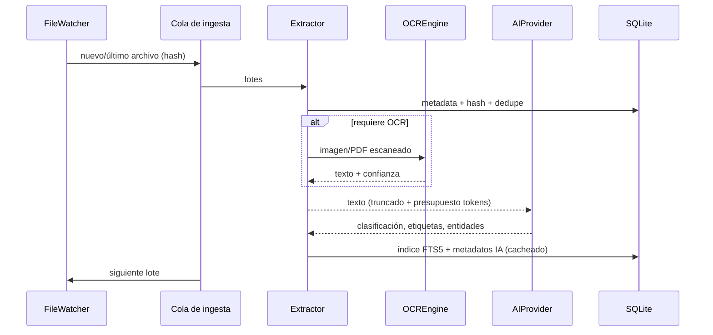
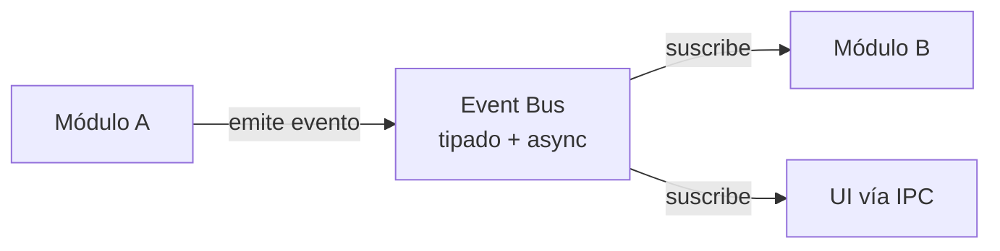

# Arquitectura — Visión general

## 1. Contexto del sistema

DocuMind Desktop es una aplicación de escritorio para Windows/Linux/macOS que clasifica, indexa y permite buscar documentos mediante IA. El 100% de los datos vive en el equipo del usuario (SQLite local); la IA es opcional y puede operar sin conexión (funcionalidad básica) o conectada (clasificación, resúmenes, búsqueda semántica).

## 2. Vistas de proceso (C4 — nivel 1 y 2)

### 2.1 Contenedores

- **Proceso principal**: servicios de dominio, repositorios, OCR, IA, watchers, respaldos, actualizaciones. Nunca accesible desde el renderer excepto por canales IPC explícitos.
- **Preload**: expone una API tipada y mínima mediante `contextBridge`; valida y restringe cada canal.
- **Renderer**: React, sin acceso a Node ni al filesystem. Recibe eventos de progreso vía IPC.

### 2.2 Capas del proceso principal (Clean Architecture)

Reglas de dependencia: la capa de dominio no importa nada de infraestructura. La inversión de dependencias se resuelve con un contenedor DI sencillo (composition root en el proceso principal).

## 3. Modelo de módulos funcionales

Cada módulo es independiente, comunica solo mediante el Event Bus y expone casos de uso.

| Módulo | Responsabilidad | Estado |
|---|---|---|
| Dashboard | Métricas y actividad reciente | Fase 5 |
| Documentos | CRUD, versionado, historial, deduplicación | Fase 3 |
| Búsquedas | FTS5 + búsqueda semántica (IA) | Fase 3 |
| OCR | Extracción de texto de imágenes/PDF escaneados | Fase 3 |
| IA | Clasificación, resumen, extracción de entidades, Q&A | Fase 3 |
| Clasificación | Reglas + clasificación por IA, etiquetas automáticas | Fase 3 |
| Etiquetas | Gestión de etiquetas inteligentes | Fase 3 |
| Respaldos | Backup/restore de la base y configuración | Fase 4 |
| Automatizaciones | Reglas: mover, renombrar, etiquetar | Fase 4 |
| Historial | Historial de cambios y auditoría | Fase 3 |
| Configuración | Preferencias, proveedor IA, claves cifradas | Fase 4 |
| Usuarios (futuro) | Multi-usuario, Argon2, roles | Post-MVP |
| Licencias | Gratuita / Pro / Empresarial (preparado, sin pagos) | Fase 6 |
| Actualizaciones | Auto-update firmado y rollback | Fase 6 |
| Logs/Diagnóstico | Logs seguros, health checks | Fase 4 |

## 4. Flujo principal: escaneo → extracción → OCR → IA → indexado

## 5. Comunicación (Event Bus)

El Event Bus es el único mecanismo de desacoplamiento entre módulos (patrón Observer). Los eventos de progreso se reenvían al renderer por IPC de solo-envío (`webContents.send`), nunca request/response para eventos de volumen.

## 6. Decisiones de alto nivel

1. **Electron sobre Tauri**: ecosistema maduro, Node para worker_threads/Tesseract y `node:sqlite` built-in, tooling electron-vite/electron-builder sólido. Se documenta en ADR-0001.
2. **SQLite + FTS5**: capacidad real de 1M+ filas indexadas con queries preparadas y escrituras en lotes; capa Repository permite migrar a Postgres/Supabase (ADR-0004).
3. **IA desacoplada**: interfaz `AIProvider` + factoría por proveedor; OpenRouter como primer proveedor (ADR-0006).
4. **Actualizaciones**: electron-updater con NSIS diferencial y verificación de firma (ADR-0008).
