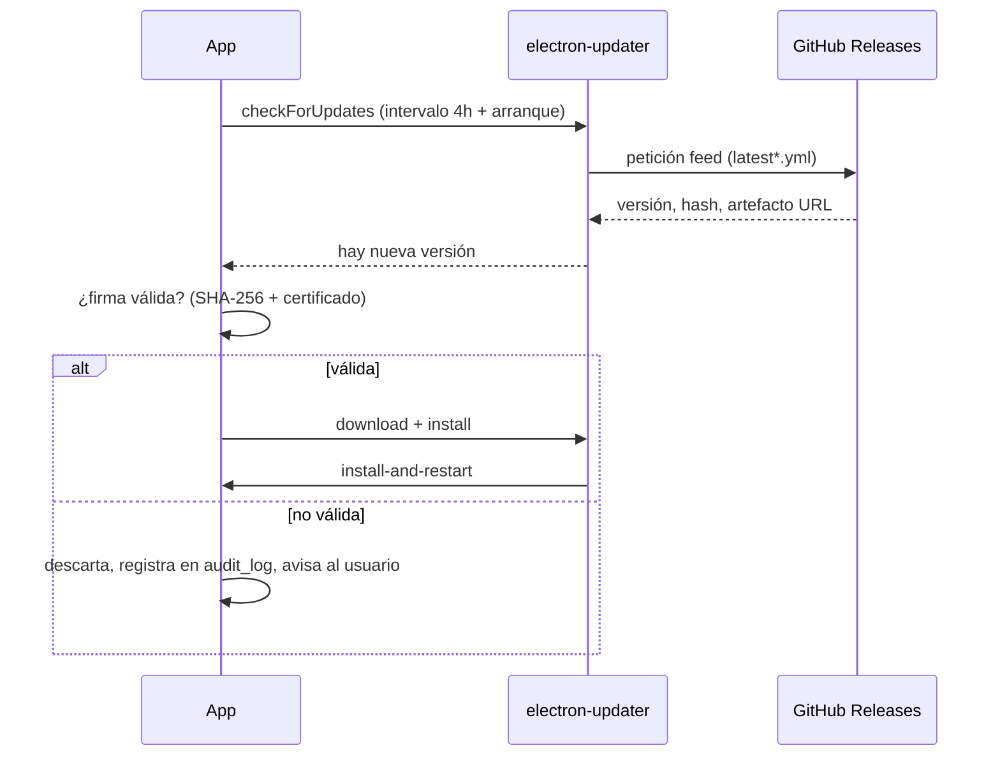

# Sistema de actualizaciones

Basado en **electron-updater** (ADR-0008). Se eligió tras evaluar alternativas; es la solución más robusta del ecosistema Electron para Windows/Linux/macOS con:

- **Actualizaciones diferenciales** NSIS (solo la diferencia binaria).
- **Verificación SHA-256** del artefacto.
- **Rollback** automático conservando la versión anterior.
- Canales `beta`/`stable` mediante etiquetas de Release.

## 1. Flujo de publicación (CI)

```
GitHub Actions (release)
  └─ build multiplataforma (Windows x64, Linux AppImage, macOS dmg)
  └─ firma: Windows Authenticode / macOS notarización
  └─ publish: github (electron-builder upload)
  └─ genera: latest.yml, latest-linux.yml, latest-mac.yml + artefactos
```

## 2. Flujo en la aplicación



## 3. Guardias de integridad

1. `sha512` del artefacto descargado se valida contra el publicado.
2. Firma de código: en Windows, verificación del certificado (sujeto/thumbprint) antes de instalar; si no coincide → bloqueo.
3. Health-check tras instalar: la app escribe `firstRun`; si al arrancar no se confirma integridad en N segundos, se ejecuta **rollback** al instalador anterior.

## 4. Configuración

- `electron-builder.yml`: `publish: github` con `provider: github`, canal por rama/tag.
- En desarrollo (`NODE_ENV=development`) las actualizaciones están desactivadas por defecto.
- El usuario puede: buscar actualización manualmente, ver changelog (del Release), diferir, y desactivar auto-update.
